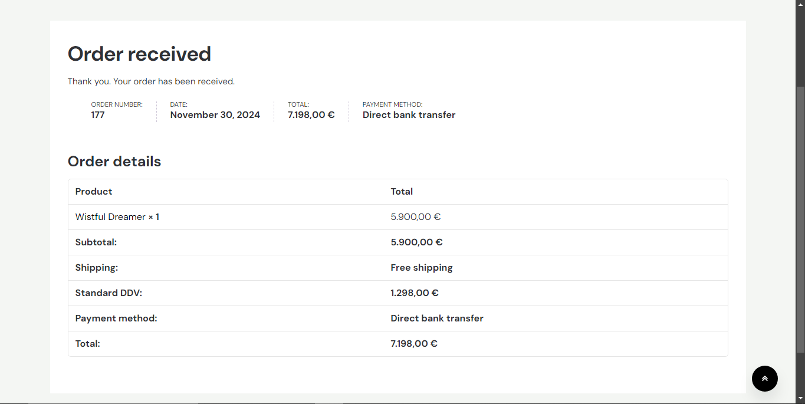

# Artwork Shop

A secure WooCommerce artwork shop featuring calculated net prices and multiple payment options, including Stripe.

## Features
- **Secure E-commerce**: Built with WooCommerce, ensuring reliability and scalability.
- **Calculated Net Pricing**: Automatically calculates and displays net prices for users.
- **Payment Options**: Integrated with Stripe for seamless and secure transactions.

## Showcase

Here are screenshots showcasing the website:

About Us
#

Empty Cart
#

Cart Suggestions
#

Filled Cart
#

Login
#

Terms and Conditions
#

Shop
#

Billing Information (Checkout)
#

Payment Options (Checkout)
#

Received Order

Orders Panel in WordPress
#

## License
This project is not licensed for public use. The code is protected by copyright law.  
Viewing is permitted for evaluation purposes only. Copying, modifying, or distributing the code is strictly prohibited.
